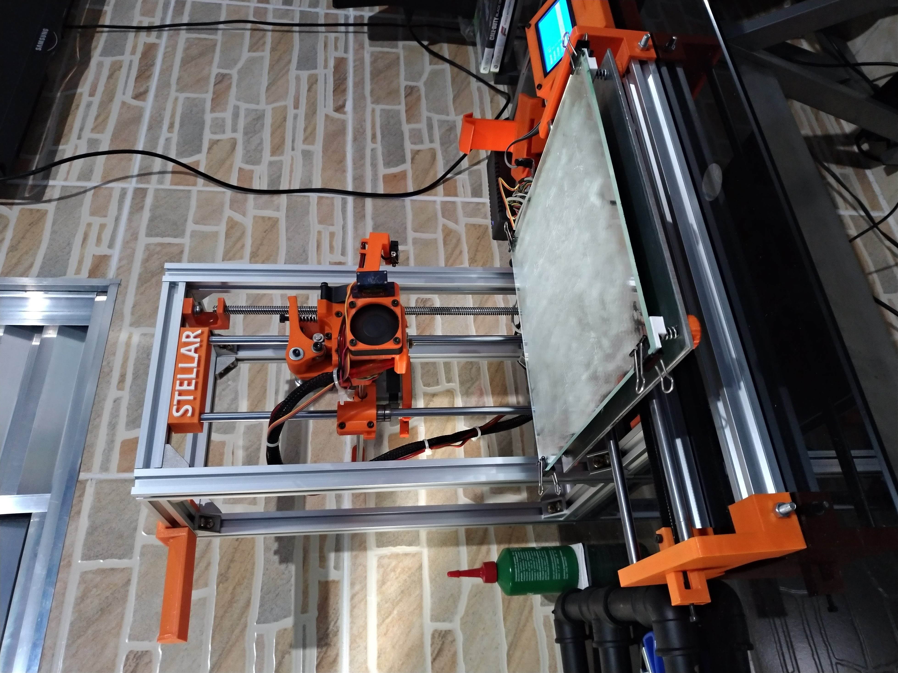

# Stellar 3D Printer (work in progress)

Stellar is my own [Smartrap](http://reprap.org/wiki/Smartrap_mini) version. I bought a brazilian smartrap version, but come with some structure problems. So, I wanted to project a new to solve and improve.

  

In this repo, I will put firmware files and eletronics schematics. The 3D files to print will be available on my Thingverse account. (coming soon)

## Features

* Build volume: 200x200x200 mm (can improve 50mm on X axis)
* Filament end detection
* Auto bed leveling
* Lights (coming soon)

## Firmware

I am using [Repetier-Firmware](https://www.repetier.com/documentation/repetier-firmware/) version 1.0.1. You can get a new version on [official site](https://www.repetier.com/firmware/v100/index.php) or use my version.

## To do

* Add bowden system
* Improve X endstop location
* Add optical probe
* Add lights
* Store location for electronics
